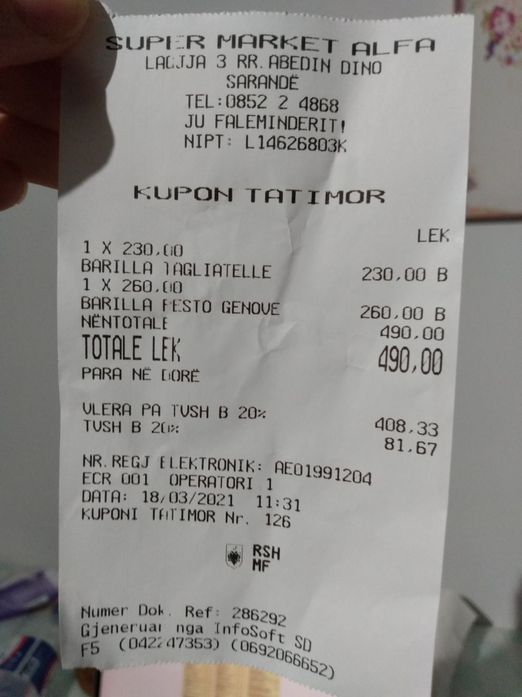
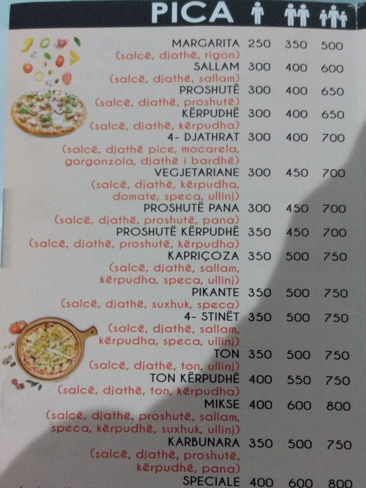
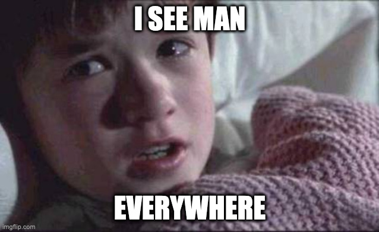
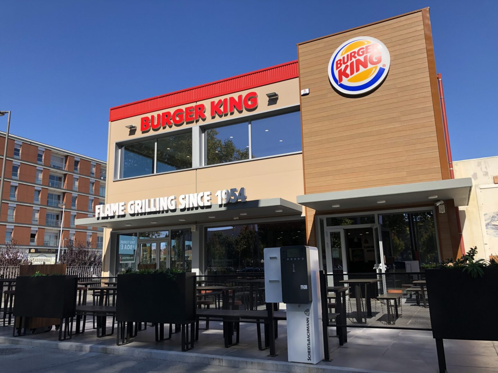
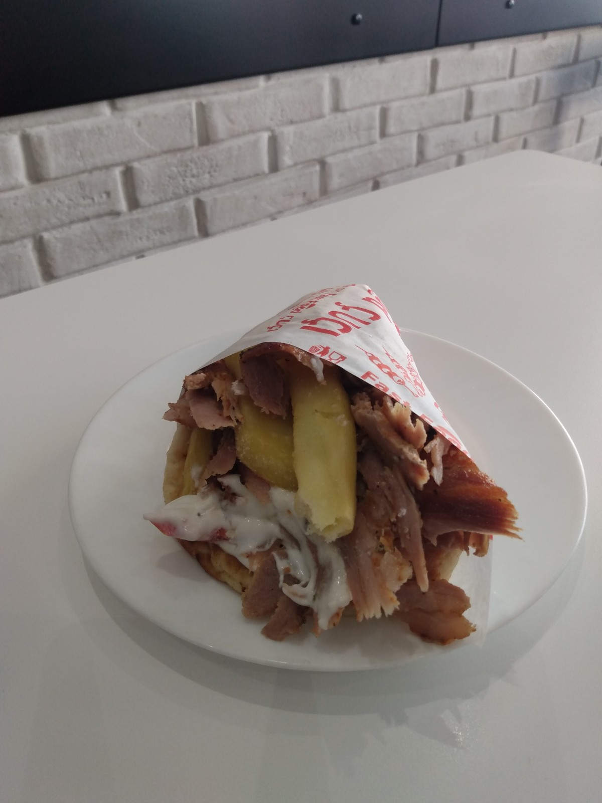
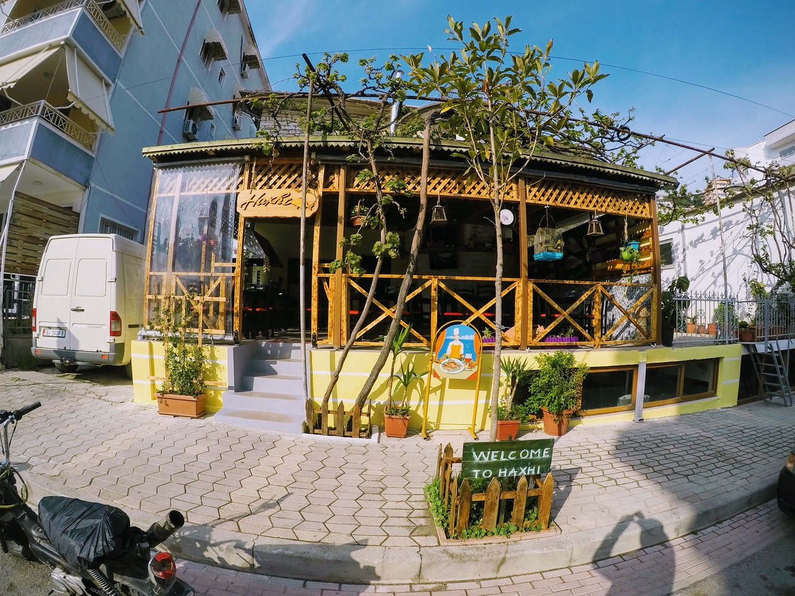
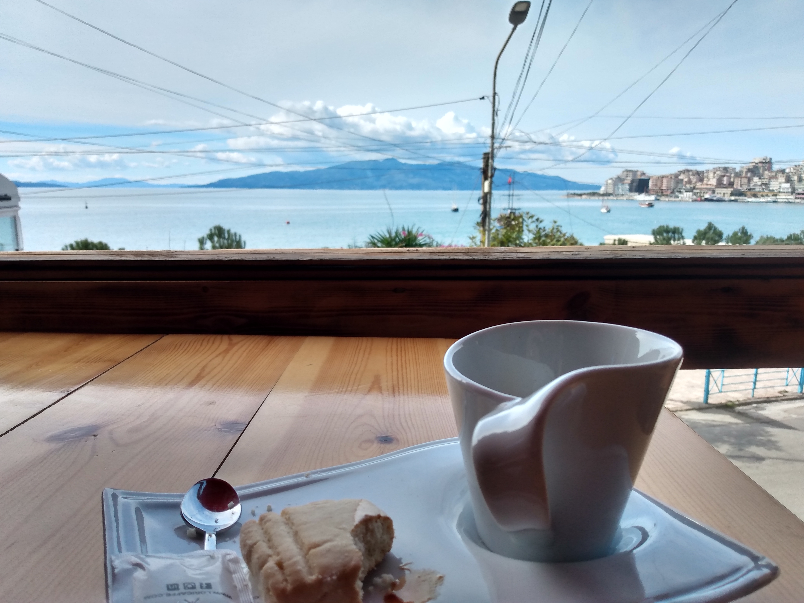

🚨🚨 **Ressalva importante:** Os posts são nossa visão (limitada) como brasileiros vivendo na Albânia há apenas 15 dias e que decidiram escrever sobre as curiosidades que mais nos marcaram nesse começo - portanto, **não os tome como verdade absoluta**!

## 1. Quem tem euro vai a Roma 💸

**...mas vai 10 vezes mais para a Albânia**!

Esse a Maithe adora! Bem pertinho da Grécia (a ponto de vermos uma de suas ilhas) e do lado da Itália, a Albânia é conhecida por ser **um país inexplorado e barato**.

Para vocês terem uma noção, uma pizza para duas pessoas sai de 4 a 5 euros, o fast food por volta de 2 euros e um prato num restaurante menos de 5 euros.

*1 Pacote de Barilla 500g + 1 molho pesto = 490 Lek = 3,98 euros = Maithe feliz* 😄

Não acredita? Tabelamos alguns preços que vimos desde que [chegamos aqui](../chegada-na-albania) para vocês verem:

| Item | Valor em Lek                                    | Valor em Euro* |
| :----- | :--------------------------------------- | ---: |
| Café expresso na orla da praia | 70 | 0,56 |
| Galão de água (6L)      | 90 | 0,73 |
| Barra de Milka (100g)      | 100  | 0,80 |
| Jantar para 2 em restaurante (prato principal + 2 cervejas) | 1200 | 9,75

*1 Euro ~= 123 Lek

## 2. Delivery de pica??

Já pensou em vir para a Albânia e pedir uma pica de 4 queijos? 😱😱

Calma minha gente! Eu posso explicar: essa é a palavra em albanês para *pizza*. 

Por sinal, o albanês já foi eleito o [6º idioma mais difícil](https://www.awebic.com/idiomas-dificeis/) de se aprender no mundo. Ainda bem que esse é um povo poliglota: muitos por aqui arranham um básico de italiano, inglês e, aqui na região de [Saranda](../dia-de-sol-em-saranda), até mesmo o grego!

*Cardápio de pica - tem para você, para a famíla, tem para todo mundo!*

## 3. Homens por toda parte

Durante uma das nossas caminhadas matinais na orla, percebi que tinha alguma coisa de estranho quando olhava ao redor: a cada passo um homem diferente passava por mim, mas quase nenhuma mulher.

Por aqui se vê homens por toda parte: nos cafés, na orla, na praça, dos mais idosos de bengalinha até às crianças - mas pouquíssimas mulheres.

Às vezes me sinto em um mundo paralelo! (mas pasmem Brasil, **sempre respeitosos** - não me senti assediada em nenhum momento).

Fomos direto para o ~~oráculo~~ Google pesquisar a proporção de homens e mulheres daqui e... tudo normal! 🤷‍♀️🤷‍♀️

#### Mas então cadê vocês mulheres?!

Temos a teoria de que elas não saem tanto na rua quanto os homens e por isso não as vemos. Mas ainda não sabemos a razão real, se alguém aí tiver uma ideia conta pra gente por que estamos curiosos.

## 4. (Sem) Fome de Méqui

O McDonald's atende em média 68 milhões de clientes por dia em mais de 120 países pelo mundo, mas... **a Albânia não é um desses países**. 🤷‍♂️🤷‍♂️🍔🍔🚫🚫

Sim, ao chegarmos aqui descobrimos que a Albânia faz parte do seleto grupo de países que não sabe o que é comer um BigMc às 5h da manhã voltando da balada (vou deixar para o leitor julgar se isso é bom ou ruim 🤷‍♂️).

*O BK é o único grande fast-food que vimos na Albânia até agora - encontramos apenas 1, e em Tirana (capital do país).*

#### Mas os albaneses não comem *fast-food*?

Mas é claro que comem! A diferença que sentimos para o Brasil é que por aqui os fast-foods são em sua grande maioria negócios pequenos e familiares, em contraste com as grandes franquias que dominam no Brasil e em outros países.

Por sinal, os fast-foods daqui são deliciosos. O nosso favorito até agora é o *Souvlaki*. Presente em quase todos os fast-foods, o *Souvlaki* é um lanche com carne, batata e tomate enrolado em uma massa deliciosa e acompanhado com coalhada seca.

*Souvlaki - massa com carne, batata, tomate e coalhada seca*

## 5. O melhor da Albânia são os albaneses

Nós poderíamos encerrar o post falando sobre as praias paradisíacas da [Riviera Albanesa](https://en.wikipedia.org/wiki/Albanian_Riviera), os sítios arqueológicos de [Butrint](https://en.wikipedia.org/wiki/Butrint_National_Park) e a cidade medieval de [Girokastra](https://en.wikipedia.org/wiki/Gjirokast%C3%ABr) - mas nenhum deles foi tão marcante para nós quanto a **simpatia e humildade** desse povo.

Desde que chegamos aqui nós já fomos presenteados com (cuidado, a lista é longa!): mexirica, leite, iogurte, bolo caseiro, café, raki (a pinga albanesa), chopp e **muitos** sorrisos! ❤️

Podemos afirmar que essa receptividade faz toda a diferença quando você está há 10 mil kilômetros de casa - quem dera todo país tratasse seus estrangeiros como a Albânia fez conosco até agora!

Temos muitos relatos para comprovar o que estamos dizendo, mas o que mais nos marcou aconteceu ontem, quando conhecemos os simpaticíssimos **Haxhi e Eva**.

#### Haxhi e Eva

Estávamos na frente de um restaurante bem avaliado pelo Google, quando, para a nossa tristeza, nos demos conta de que estava em reforma.

Já estávamos indo embora quando um homem acenou pela varanda do restaurante e fez sinal para entrarmos:
> Come in! Free coffee for you!

ele dizia.

Como bons brasileiros formados na escola da vida, hesitamos por um momento, mas resolvemos dar uma chance e entrar.

E foi assim que, para nós, o que era o "homem na varanda" passou a ser o Haxhi, dono do restaurante que leva seu nome, pai de dois meninos e esposo de Eva, a cozinheira mais famosa de Saranda (segundo as avaliações do Google).

Alguns vão pensar que ele estava simplesmente interessado em promover o seu restaurante recém-reformado (e se era isso mesmo, conseguiu 😂).

Mas para nós ficou a certeza de que para ele se tratava de algo mais: acolher dois ~~perdidos~~ estrangeiros no seu mais novo cantinho em frente ao mar.

*Free simpatia no Haxhi*

Ficamos encantados com a sua empolgação: ele nos apresentou desde o homem que instalou a câmera até os novos utensílios de cozinha.

A empolgação era tanta que o que era inicialmente "free coffee" virou "free biscoitinho", "free suco de maçã", e "free raki" (pinga albanesa). Só fomos autorizados a ir embora quando terminamos o banquete todo. 🤣 E ai de nós se insistíssemos em pagar a conta!

## E aí, já querem vir para a Albânia?
Pois nós queremos é continuar! Esperamos que vocês tenham gostado desse post que para nós foi uma mistura de pura vivência e curiosidade.

Até a próxima 😊
