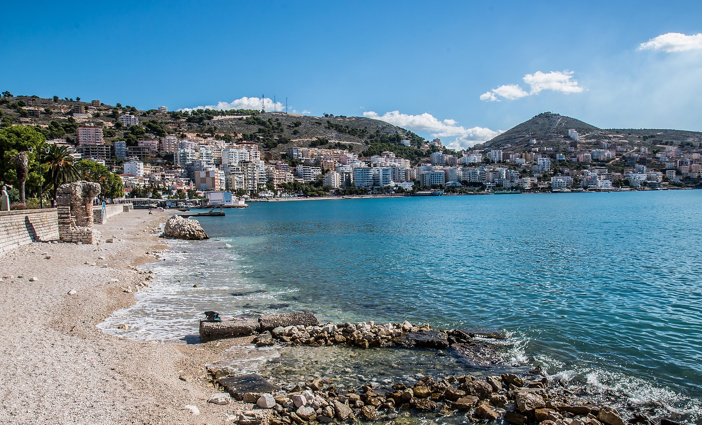
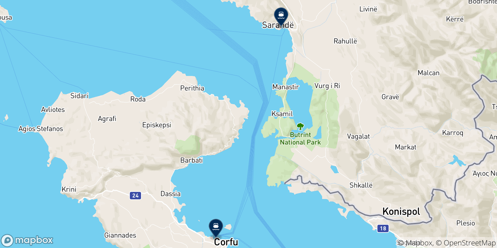
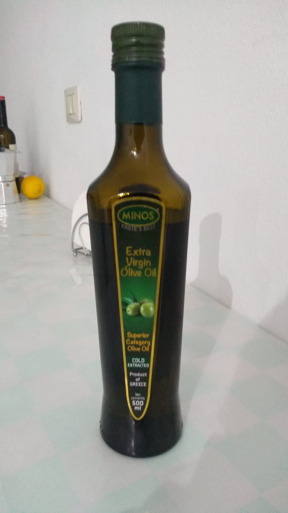
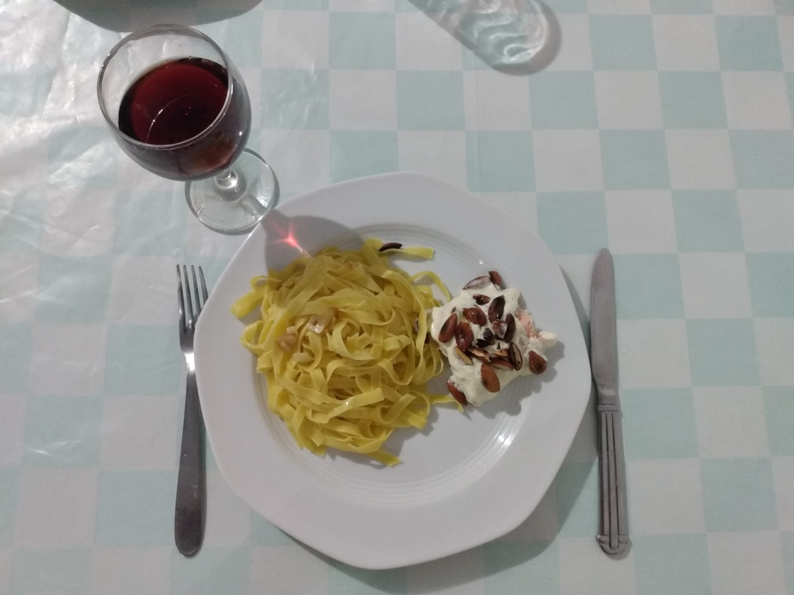

Hoje foi dia de mais viagem! Depois de um café da manhã apressado para não perder o ônibus, deixamos o hotel no Bbloku rumo a estação para pegarmos o ônibus para Saranda.

## Saranda

Saranda é uma cidade de praia localizada no sul da Albânia, na região chamada de [Riviera Albanesa](https://en.wikipedia.org/wiki/Albanian_Riviera). A cidade tem uma população de aprox. 60 mil habitantes, e os turistas costumam utilizá-la como base para conhecer as várias praias aqui na vizinhança.

*Vista da orla de Saranda*

Por falar em vizinhança, Saranda fica extremamente perto da fronteira com a Grécia. A ilha de Corfu, por exemplo, está situada há apenas 35km de distância.

Essa proximidade ficou muito evidente para nós antes mesmo de chegarmos em Saranda: na estrada, muitos dos anúncios e placas estavam escritos em Grego 😱

*Saranda fica há 35km da ilha grega de Corfu*

No mercado, vários produtos gregos na prateleira, em particular vinhos, azeites e queijo feta. Ficamos muito curiosos também para provar uma espécie de "mel grego" que encontramos, mas não tivemos coragem de pagar o equivalente a quase 5€ por isso. Quem sabe na próxima!

*Azeite grego que compramos hoje no mercado*

## Primeiros micos na Albânia

Hoje, fomos pela primeira vez fazer mercado desde que chegamos. Separamos alguns [*leks*](https://pt.wikipedia.org/wiki/Lek) e fomos para o mercado. 

Na hora de pagar, a surpresa: **a conta tinha dado quase 20x mais do que eu tinha na carteira**. O motivo? Na hora de colocar o dinheiro na carteira nós erramos a conversão Euro <> Lek e acabamos levando uma quantia ridiculamente pequena perto do que íamos comprar.

Resultado: tive que largar as compras lá e voltar para o apartamento para pegar mais grana. Acontece 🤷‍♂️ Grazadeus a moça do caixa falava bem inglês e foi possível explicar a situação sem muitas dificuldades.

## Ainda temos muito para conhecer

O dia passou e acabou que não conseguimos conhecer a cidade ainda. Chegamos em Saranda por volta das 15h30 e ficamos por conta de arrumar o apartamento e cozinhar nossa janta. Pelo menos, foi uma senhora janta! Tagliatelle e salmão ao molho de limão siciliano com amendôas.

*Primeira janta em Saranda*

Esperamos que amanhã consigamos pelo menos dar uma passeada na orla, que fica há menos de 5 minutos aqui do apartamento.

O Lucas volta a trabalhar amanhã, então provavelmente a frequência dos posts vai dar uma diminuida. Mas sempre que possível continuaremos atualizando o blog por aqui.

Até a próxima!
