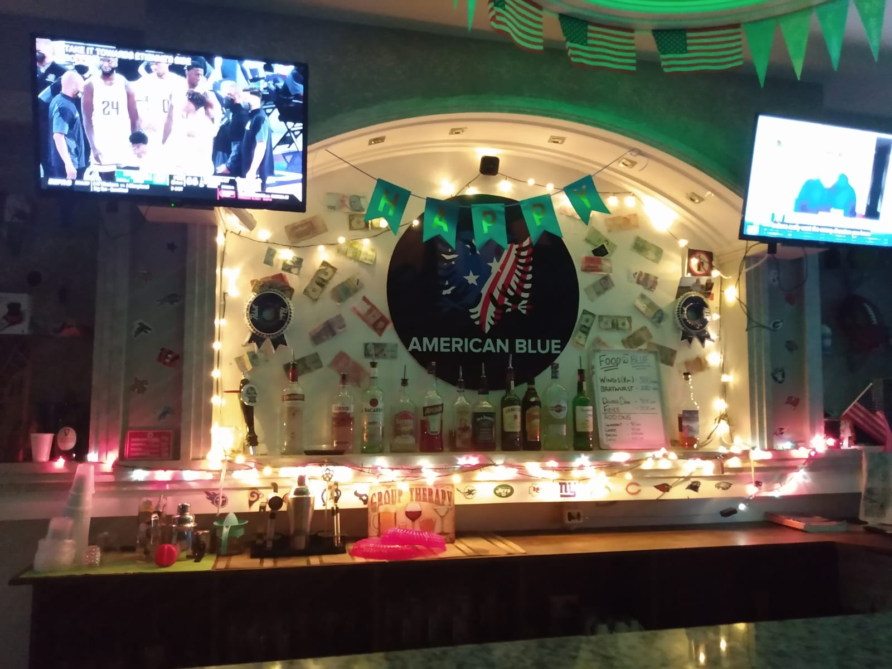
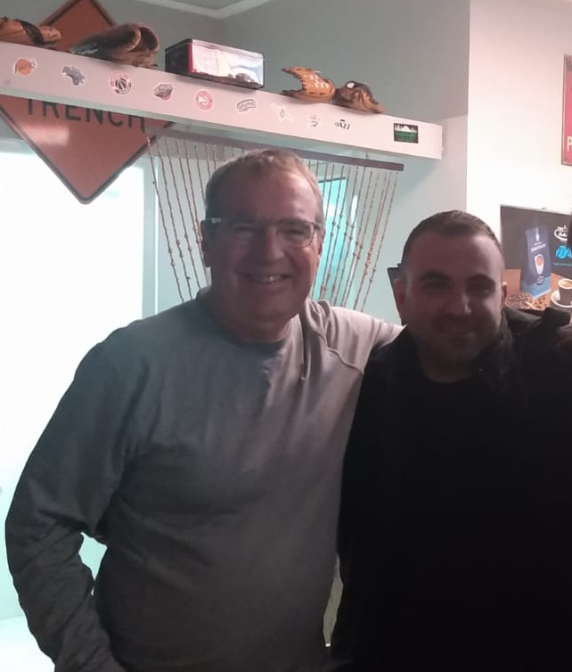
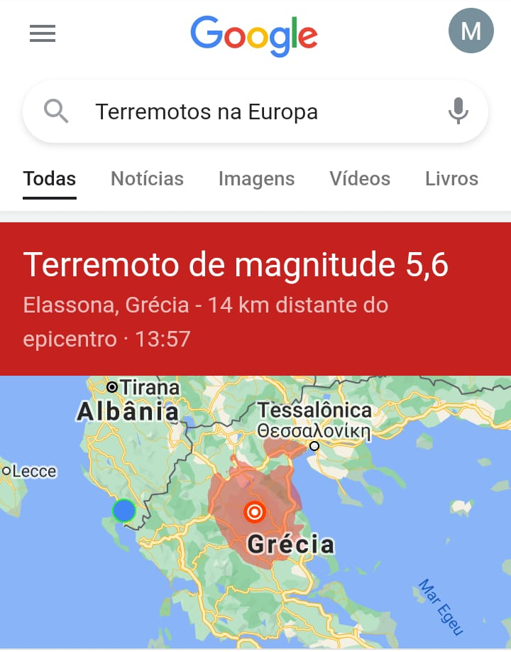
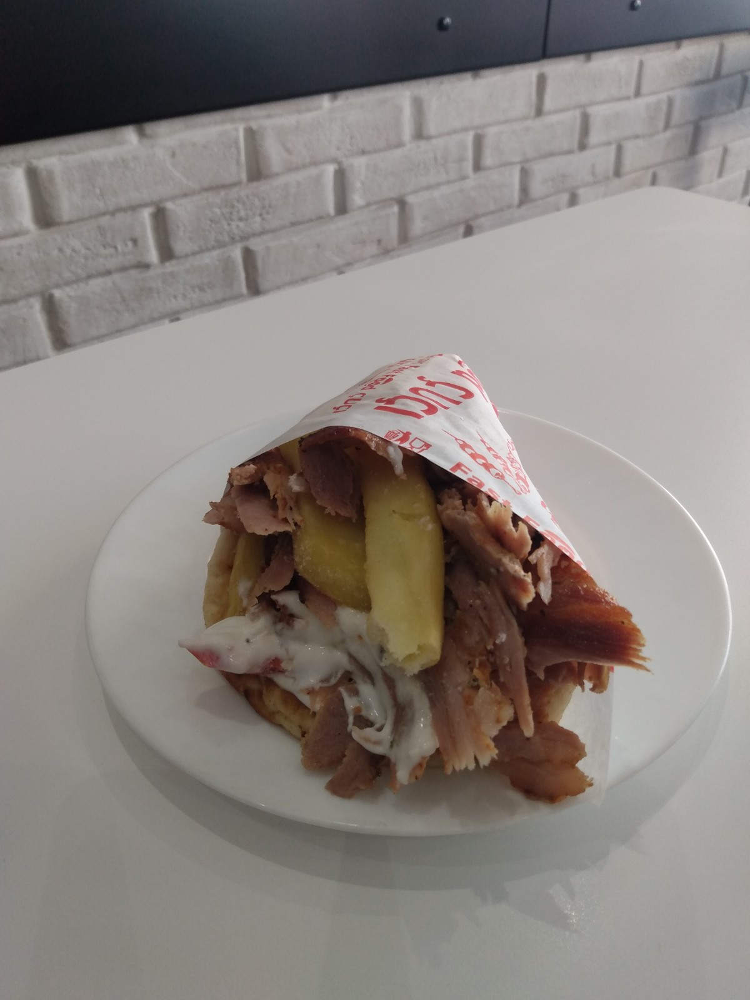
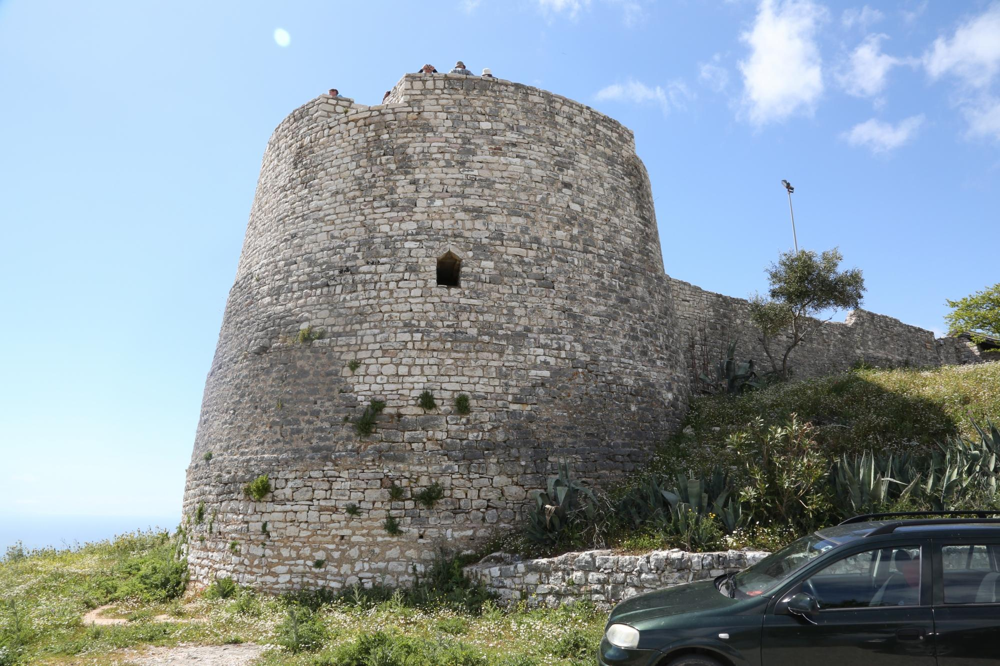
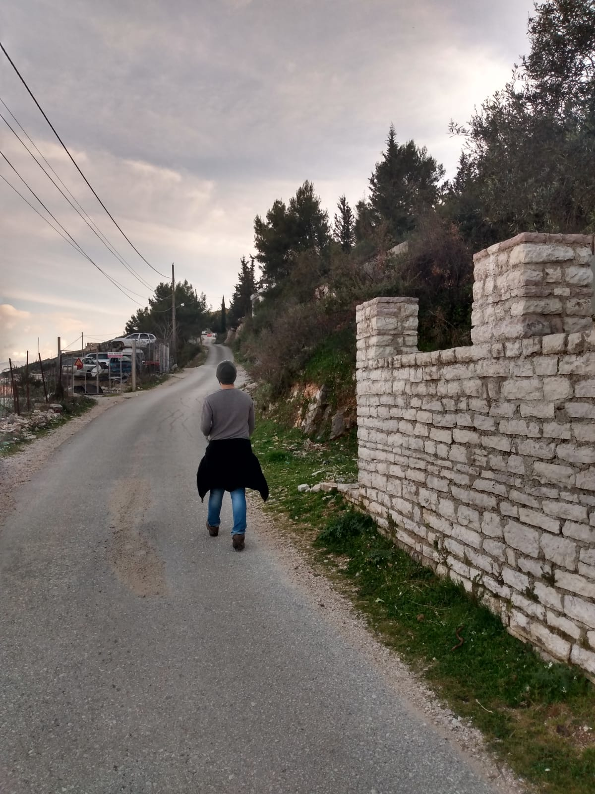
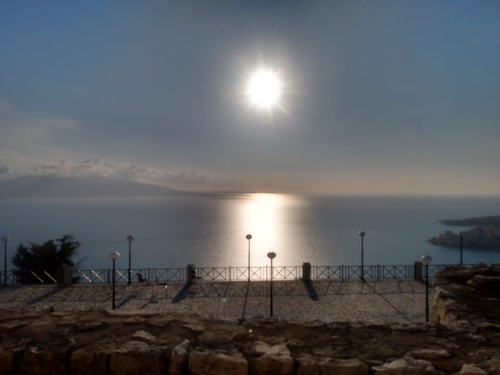
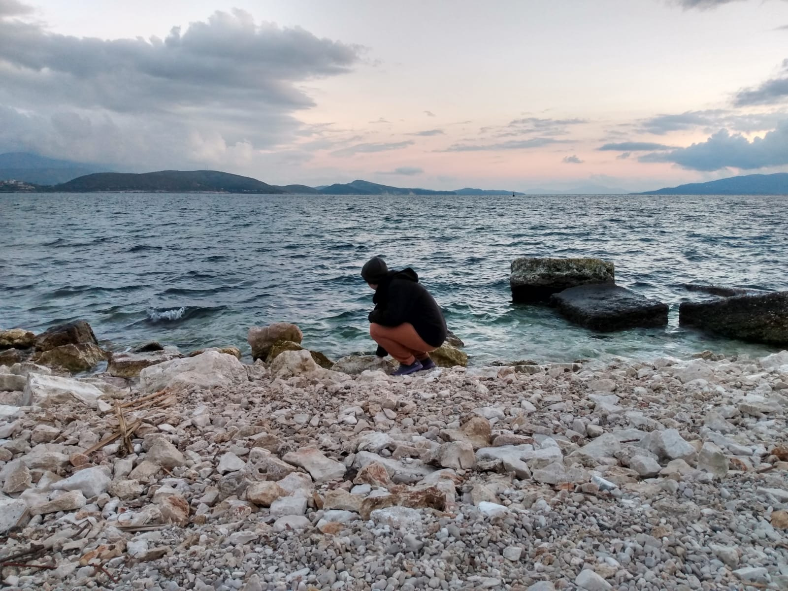
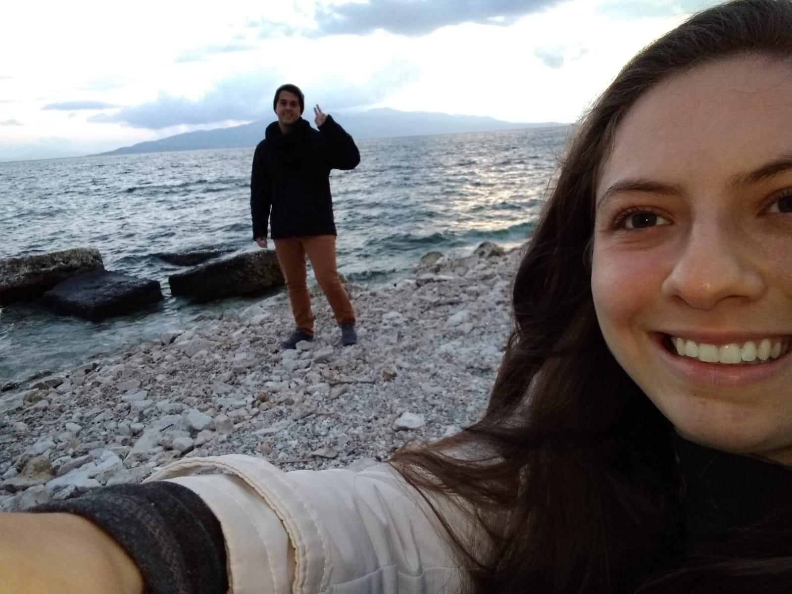
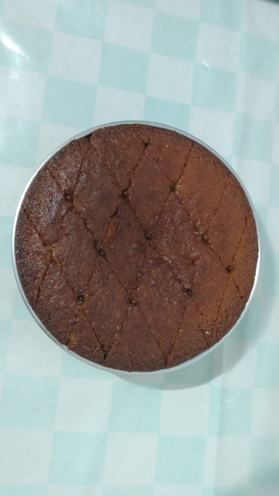

Finalmente, nosso primeiro fim de semana em Saranda! Teve praia, castelo, restaurantes, terremoto... mas vamos começar pelo começo!

## Sextou com S de Saranda

Seguindo a dica da Tara e do Shane, na sexta-feira fomos conhecer o American Blue: um pequeno bar pertencente a um americano chamado Bob, que um dia decidiu vir conhecer Saranda e nunca mais saiu daqui.

*American Blue Bar*

Ao chegarmos, Bob nos recebeu logo na entrada. Após contar a ele de onde éramos, ele logo nos puxou para dentro do bar e mandou um ***"BRAZIL IS IN THE HOUSE!!!"*** para todas as (seis) pessoas ouvirem. E foi assim que conhecemos George e Alban.

George é um americano que depois de passar mais de 30 anos trabalhando como Engenheiro Civil resolveu largar tudo e ir viajar o mundo. Seu destino inicial seria a Colômbia, mas a pandemia acabou adiando sua chance de colocar a prova seus dois anos de aulas de espanhol.

Alban é um albanês (não, isso não é um trocadilho) que é fã de futebol brasileiro e conhece Sócrates, Rivelino, e Zico! Pena que no Brasil ele torce para o São Paulo.

*George, Alban e Lucas*

## Terremoto?

Algumas horas mais cedo, a Maithe saiu desesperada do quarto dizendo que estava tudo tremendo. Após dar um Google, descobrimos que era um terremoto de magnitude 5,6 que teve origem em algum lugar da Grécia, e refletiu aqui em Saranda. 😱 😱 😱

*[Perrengues chiques](https://www.instagram.com/perrengue_chique/)*

## Sábado

O sábado começou com um **mini-tour gastronômico**: provamos de tudo um pouco dos lugares aqui da vizinhança que estavam na nossa lista. O destaque vai para o *Souvlaki*, um fast-food albanês muito gostoso (e também muito barato!) que experimentamos no almoço.

*Souvlaki - massa com carne, batata, tomate e coalhada seca*

A tarde, fomos visitar o [Castelo de Lekuresi](https://en.wikipedia.org/wiki/L%C3%ABkur%C3%ABsi_Castle), que foi construido no século XVI em um dos pontos mais altos aqui da cidade. E põe alto nisso: 1 hora de subida a pé para chegar no bendito castelo (mas que foi totalmente recompensada pela vista sensacional lá de cima).

*Castelo de Lekuresi*

*1 hora de caminhada até o castelo* 😩  *matemática da Maithe -> 1 taxi a menos = 1 souvlaki a mais no jantar*

*Fim de tarde no castelo*

## Domingo

Depois de uma sexta-feira e sábado agitados, tiramos o domingo para descansar um pouco e nos prepararmos para a semana. O destaque fica para uma praia escondida que descobrimos no caminho para o restaurante.

# Mais presentes?!

Ah, e quase já íamos nos esquecendo! Ao chegarmos em casa agora há pouco, demos de cara com a Mariana (proprietária do apartamento) nos esperando na porta com um bolo na mão feito por ela. Tem como não amar?

*Bolo de laranja da Mariana*

# Tudo que é bom dura pouco

O fim de semana passou voando e aqui estamos nós indo para a nossa segunda semana em Saranda. Pelo menos, agora temos um bolinho para alegar a segunda-feira de manhã.

Até a próxima e *mirupafshim*!

