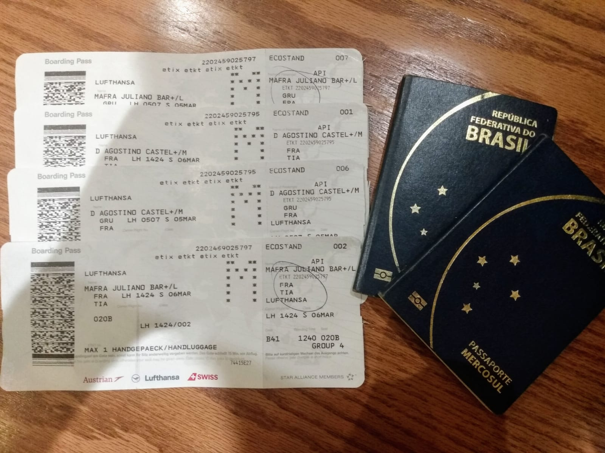

Esse final de semana começamos uma das aventuras mais malucas e também mais incríveis de nossas vidas: mudar-se para a Europa!

E começamos por um destino inusitado: a Albânia (sim, Albânia!!! 😱). Chegamos aqui neste sábado (07/03/2021), depois de 11 horas de vôo de **São Paulo** <> **Frankfurt** e mais 2 horas de vôo de **Frankfurt** <> **Tirana**. Que rolê!

*Passagens São Paulo <> Frankfurt e Frankfurt <> Tirana*

Chegamos em Tirana, capital do país, onde ficaremos por 2 dias antes de partir para Saranda, uma (linda) cidade de praia situada no sul do país.

As nossas primeiras impressões de Tirana foram muito boas: um povo muito simpático e receptivo, uma cidade muito viva e uma gastronomia **maravilhosa**! Mas os detalhes deixaremos para um próximo post; agora vamos descansar que amanhã tem mais viagem.

Até mais! Ou como diriam os albaneses: *shihem*i!
