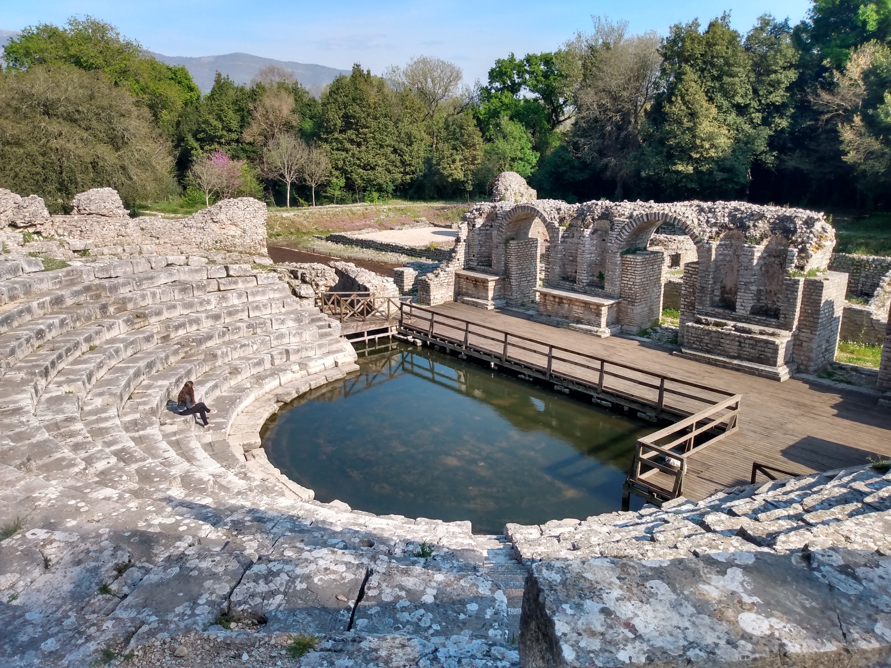
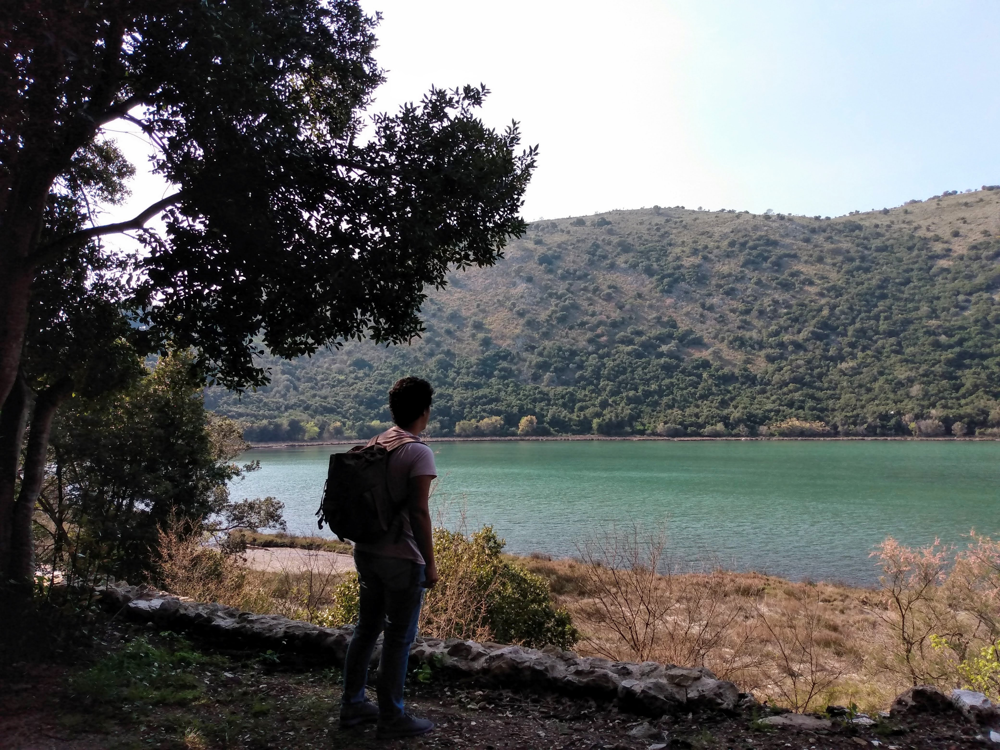
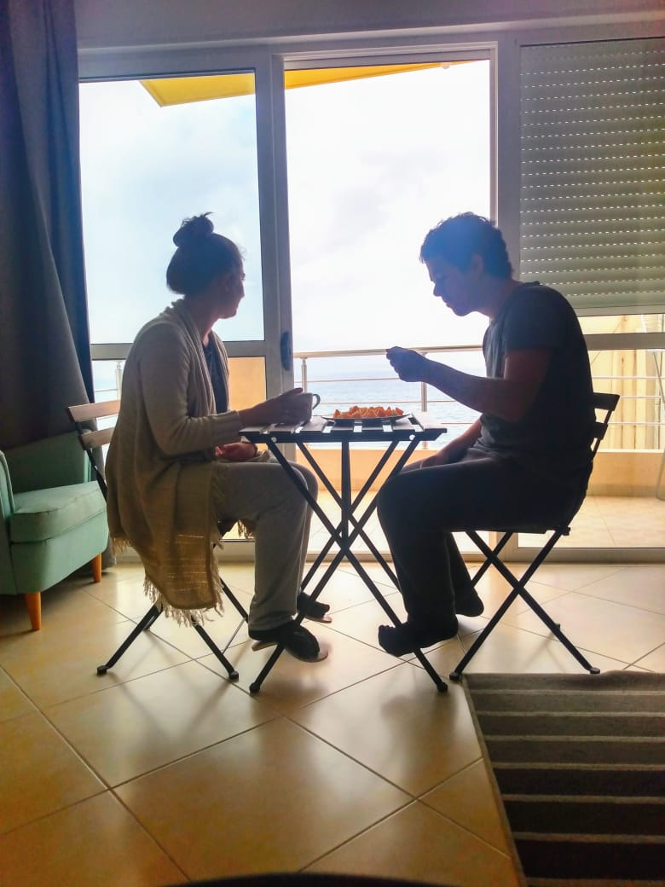
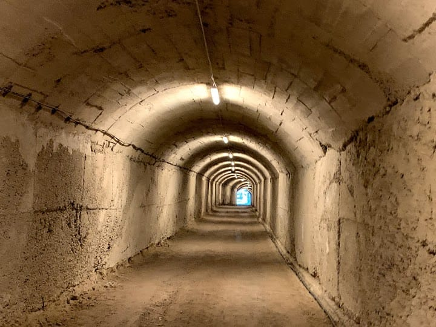
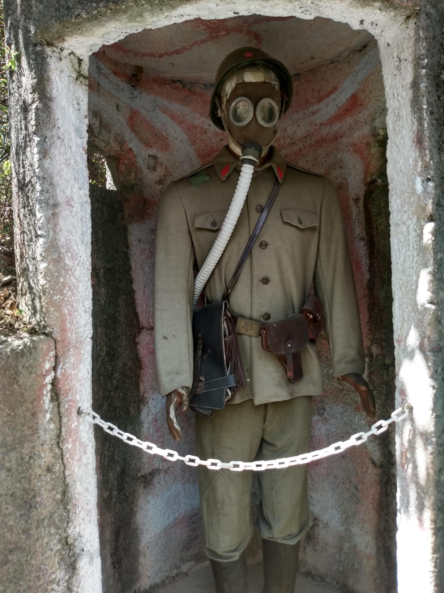
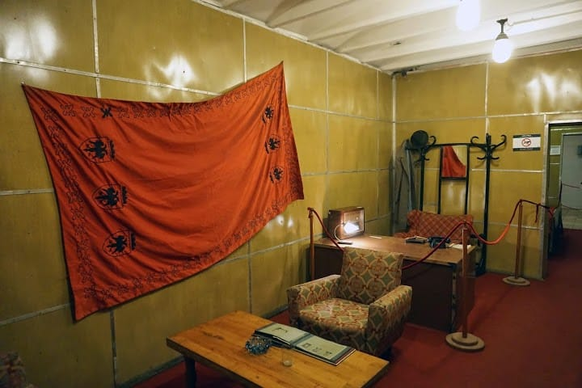
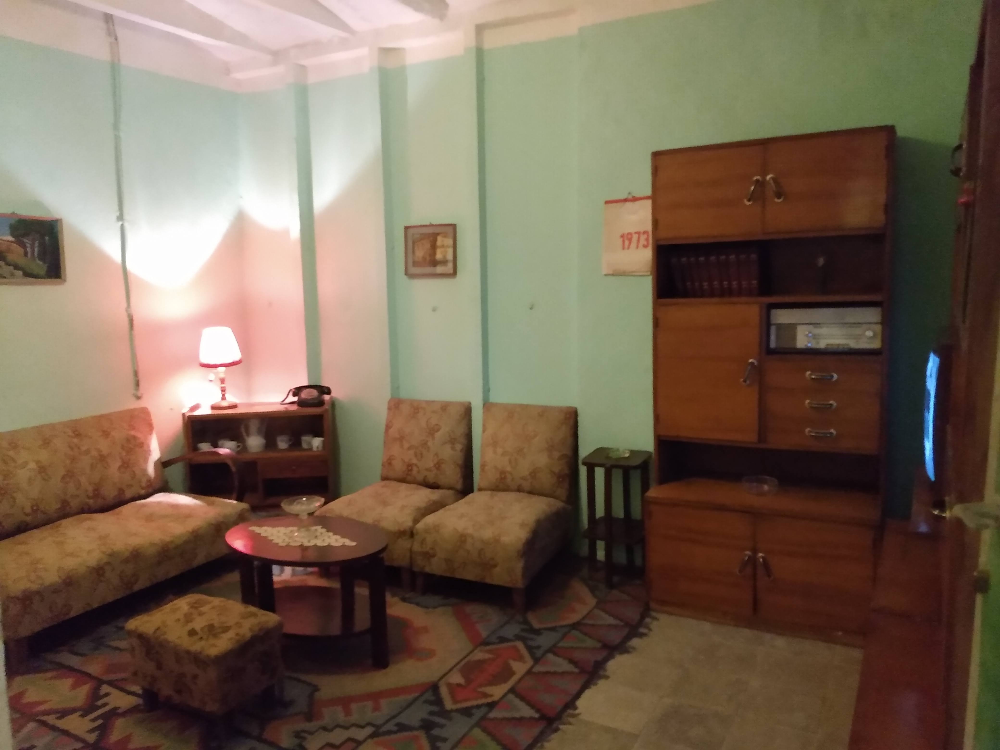
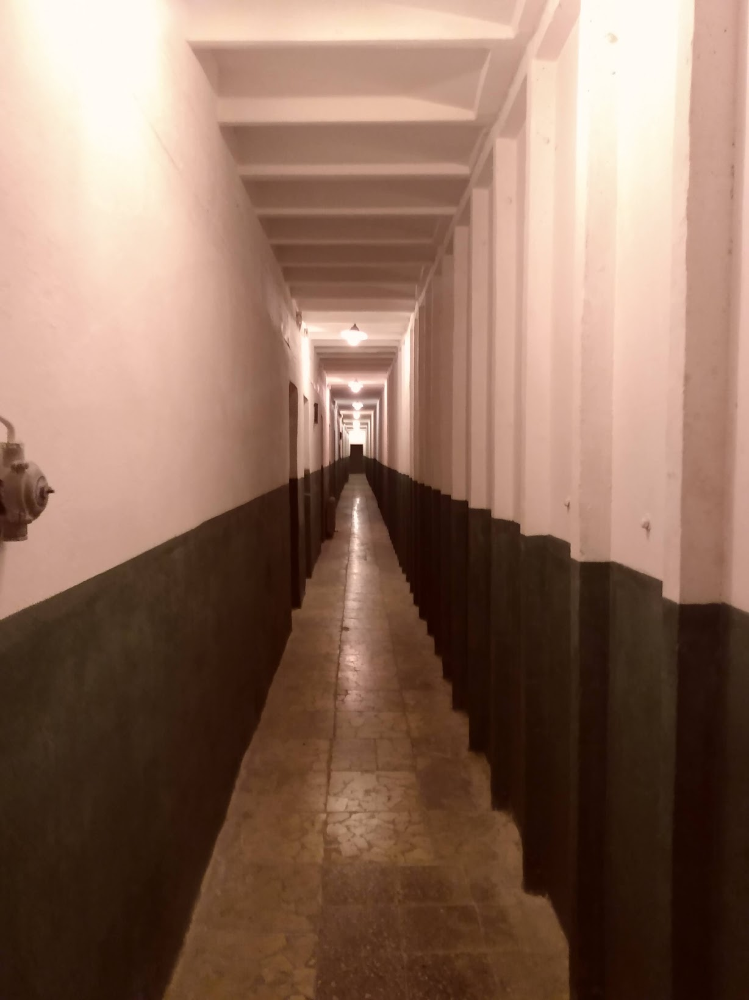
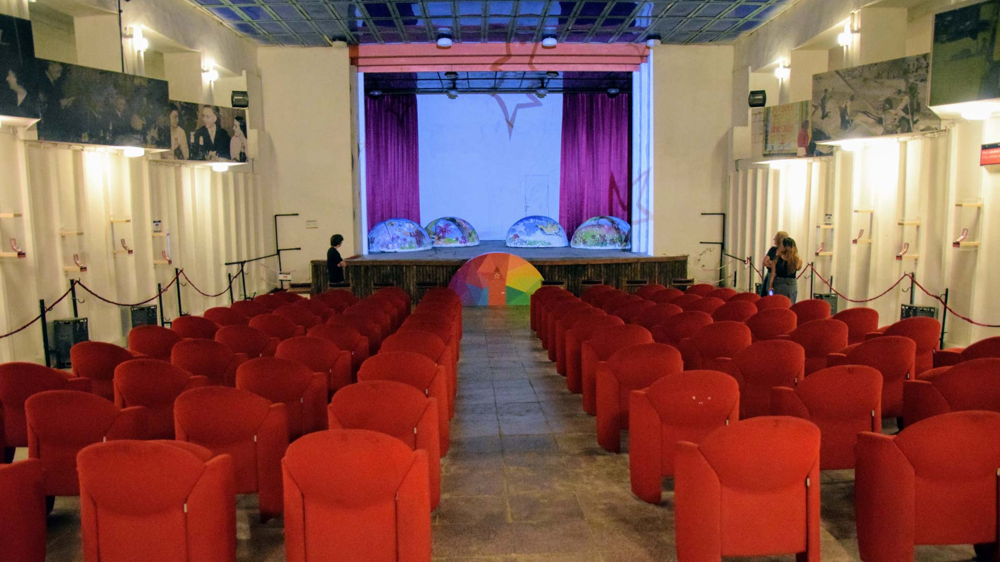

Olha nós de novo aí gente! Depois de 21 dias, 750km e vários euros mais pobres, finalmente conseguimos um tempinho para atualizar o blog.

Teve despedida da Albânia, chegada de novos ares (frios, diga-se de passagem), e muitas histórias... Mas vamos começar pelo começo!

# Butrint

No nosso último fim de semana em Saranda nos rendemos às várias indicações e fomos conhecer Butrint: um lindo sítio arqueológico com mais de 3 mil anos de história e que hoje é patrimônio mundial da UNESCO.

*Teatro grego: Butrint foi inicialmente uma importante cidade da Grécia antiga, sendo posteriormente dominada pelos impérios romano, otomano e veneziano.*

`video: https://www.youtube.com/watch?v=qdww-ga74Y0`
*Além de ser uma aula de história ao ar livre, Butrint tem também uma natureza linda!*

*Eu dando uma de blogueirinha* 😂

# Até logo Saranda

Tínhamos acabado de nos mudar para o apartamento mais charmoso de Saranda, mas os planos mudaram de repente e nos vimos tendo que nos despedir (por enquanto) dessa linda cidade antes de seguir rumo a Croácia.

Saranda - café da manhã de despedida no nosso cafofo 💔

Porém, antes de deixarmos a Albânia ainda tínhamos uma última parada: conhecer um dos bunkers albaneses!

# Bunk'Art

Uma das curiosidades que deixamos de fora no nosso [outro post](../5-curiosidades-uteis-sobre-a-albania) é que a Albânia possui mais de 173 mil *bunkers*, construídos durante o período da Guerra Fria com o intuito de proteger a população em uma eventual guerra nuclear.

O principal *bunker* da época hoje se tornou um museu de história subterrâneo e leva o nome de *Bunk'Art*.

*Entrada do bunker*

*Túnel de acesso ao bunker*

*Máscara anti-gás da época - e tem gente achando ruim usar N95* 😅

O que mais impressiona no Bunk'Art é a dimensão desta construção: são mais de **100 quartos**, alguns deles situados a mais de **100m abaixo do solo**.

Os aposentos mais luxuosos, destinados aos comandantes do partido, possuem quarto, cozinha, sala, escritório e banheiro privados (e posso garantir que melhores do que muito AirBnB que já ficamos 😂).

*Escritório do alojamento pertencente ao líder do partido, Enver Hoxha*

*Sala de um dos aposentos*

*Um dos longos corredores que conectam os aposentos do bunker*

*O bunker tem até um teatro em seu interior* 😱

# Alô Croácia

Depois de 35 dias vivendo na Albânia, nosso novo destino: Croácia 🇭🇷

Um misto de saudade de deixar um lugar que agora já nos era familiar com a euforia de conhecer um lugar novo é o que estamos sentindo.

Sempre dizem que a vida de nômade é sobre se desapegar. Mas o que nossa experiência em Saranda nos ensinou é que o desapego não é a ausência de apego - e sim estar disposto a criar novos laços, ainda que isso signifique deixar os antigos para trás.

Deixaremos as novidades da Croácia para um próximo post!

Boa semana à todos ❤️🇧🇷🇭🇷
