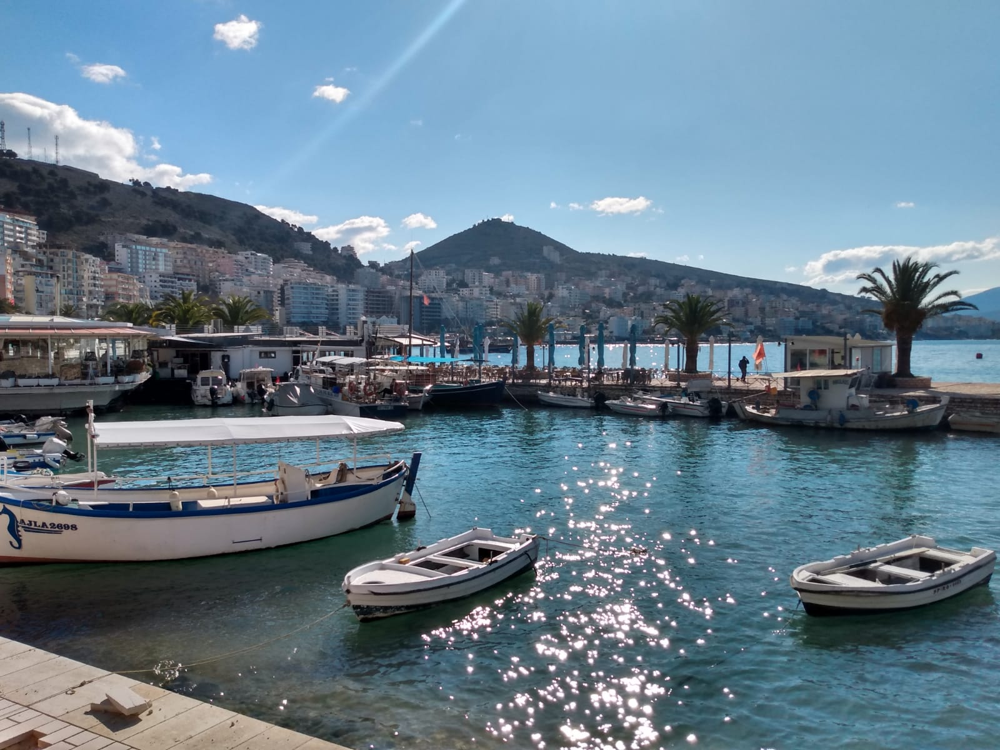
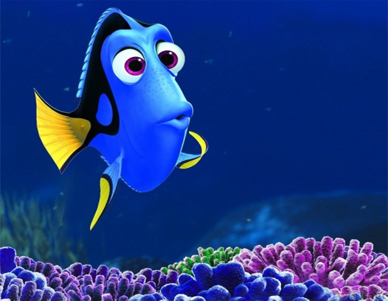
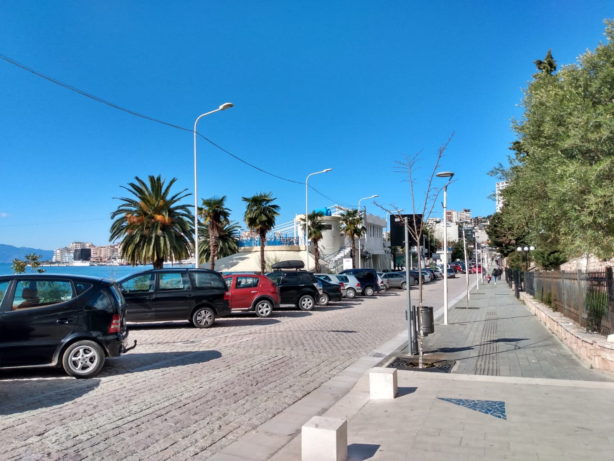
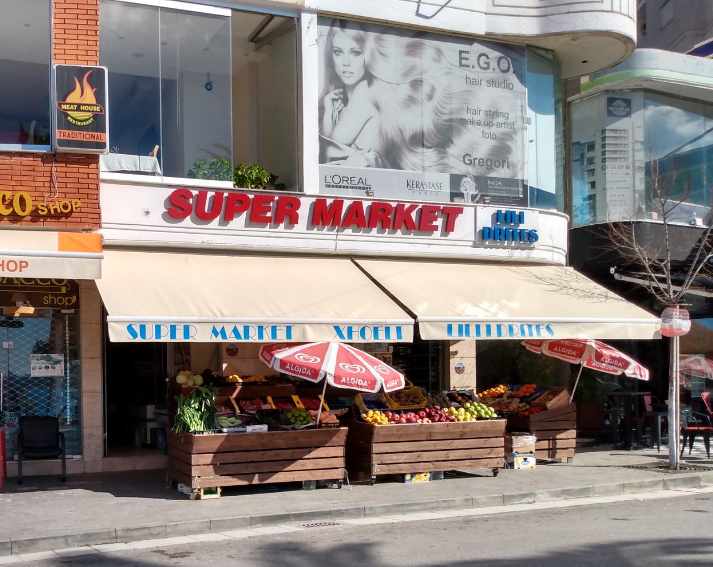

Depois de uma quarta-feira de muita chuva e frio, hoje abriu um solzão aqui em Saranda e aproveitamos para conhecer um pouquinho mais da cidade.

*Vem sol!*

Decidimos seguir a dica da Tara e do Shane e fomos até o porto, onde se pode comprar peixe fresquinho pescado durante a noite aqui na baía de Saranda.

Depois de muita mímica, e com a ajuda de um senhor que normalmente é taxista mas hoje foi nosso intérprete de Italiano<>Albanês, conseguimos nos fazer entender e comprar dois peixes (já limpos!!) para fazer no almoço.

*Queríamos muito ter uma foto para mostrar dos peixes frescos de hoje, mas a gente esqueceu*

No caminho da volta, resolvemos fazer um trajeto diferente: ir pela rua de cima e passear pelo centrinho de Saranda. E não nos arrependemos: *é um charme!* Moradas brancas com topo azul fazem lembrar um país muito famoso aqui vizinho...

*Grécia para quem tem euro, Saranda para quem tem Lek*

## O primeiro merchant deste blog

O blog não tem nem 5 dias, mas já faremos nosso primeiro merchant aqui: esse mercadinho de frutas nos deu uma tangerina em troca de uma boa publi em nosso blog.

Brincadeiras a parte, a dona deste mercado é uma fofa - quando fomos pagar pela nossa mexerica, ela insistiu nos dá-la de presente - e ainda mandou um *Ciao belli!* quando deixamos o mercado. Pura simpatia!

Óbviamente que ela fez isso sem pretensão alguma de retorno, mas mesmo assim prometemos que iriamos divulgá-la entre todos os nossos 7 (porém fiéis) leitores... então aqui está: se um dia vierem para a Albânia, lembrem-se de passar no **Supermarket Lili Drites**!

## Já é quase sexta-feira!
Com 1 mexirica, 2 peixes e 3 pés e meio (sim, a Maithe já está quase 100%!!) voltamos para casa fazendo planos para o nosso primeiro fim de semana em Saranda - mas isso já é assunto para outro post. 

Até a próxima! 😘
