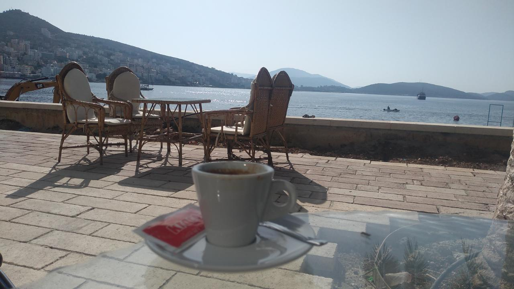
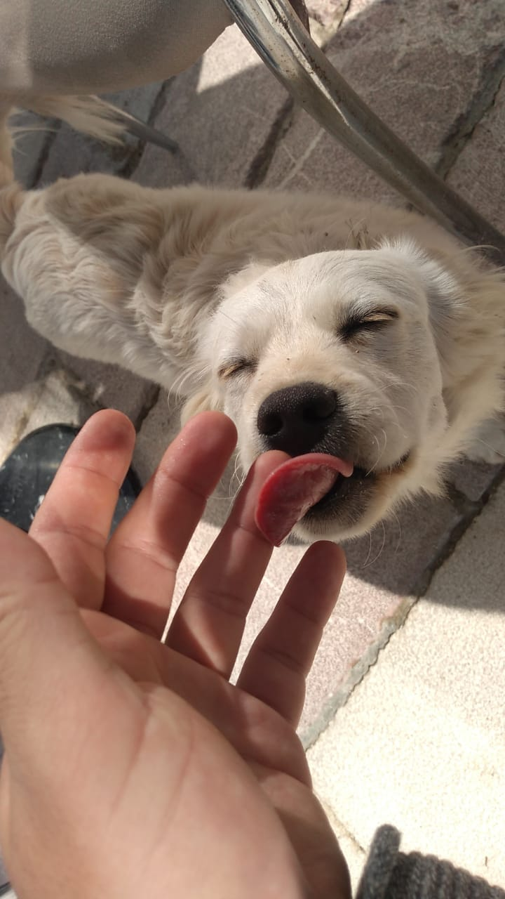
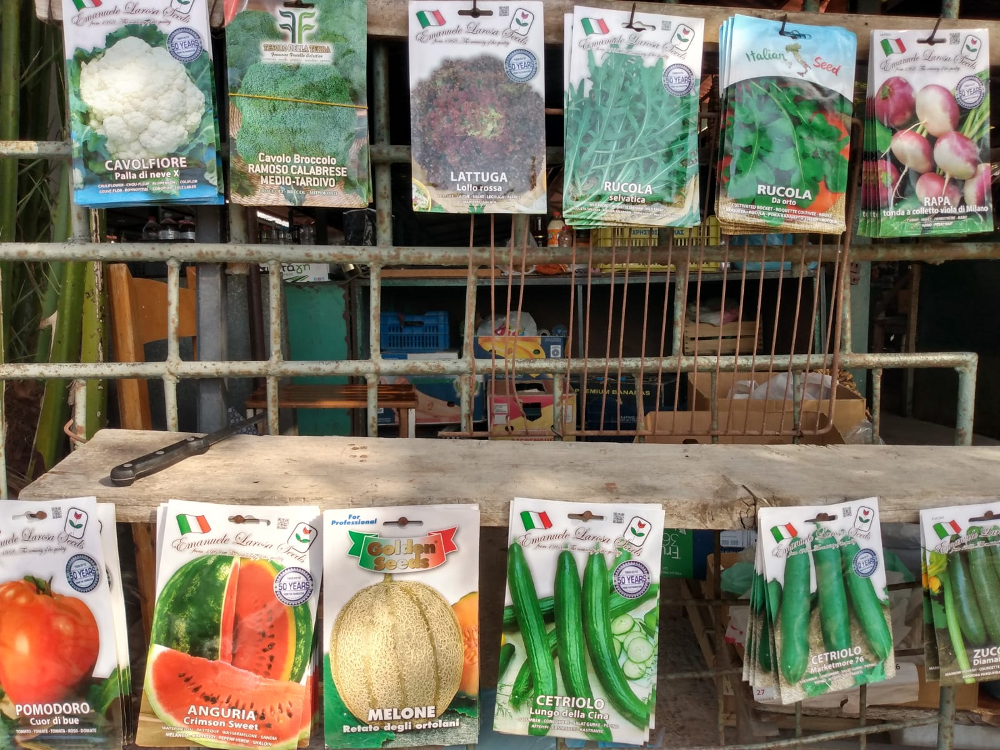
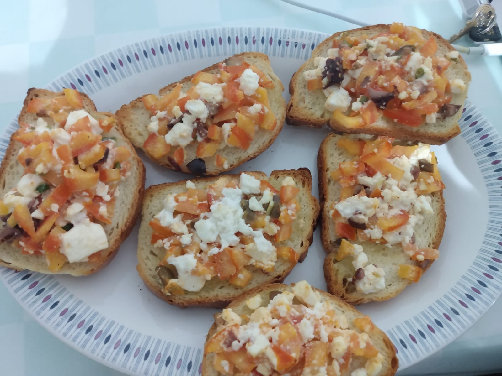

Após a euforia dos primeiros dias, estamos começando a (tentar) criar uma rotina. Como o Lucas trabalha durante o periodo da tarde e começo da noite, decidimos usar a manhã para passear na orla e conhecer um pouquinho a cidade. O apartamento fica há apenas 5 minutos andando (ou no caso da Maithe, 15 min mancando) da orla da praia.

*Durante o café hoje de manhã*

Lá, pedimos um café e conhecemos o Tobby, um cachorrinho branco e sapeca que mora na orla, não é de ninguém mas é de todo mundo. Foi muito fácil ganhar a atenção dele com a mexerica que tínhamos e um pouco de carinho.

*Tobby!!!!!!*

De longe começamos a ouvir palavras familiares (alguém que fala inglês, amém!!) e foi assim que conhecemos Tara e Shane, um casal Australiano muito simpático que já fazem de Saranda sua casa há 3 meses. Pegamos várias dicas de coisas para fazer, locais para conhecer e, principalmente, comidas para comer!

Na volta para a casa, paramos em um mercado onde compramos alguns ingredientes básicos para passarmos os próximos dias: pão, frutas, verduras e (muito) queijo feta.

*Anúncio dos produtos aqui no mercado local, tudo em italiano*

Após almoçarmos o clássico Restodontê, o Lucas teve o seu primeiro dia de trabalho daqui da Albânia. Estávamos com receio de como seria, mas a internet funcionou perfeitamente e correu tudo bem 🙏

Na janta, uma bruschetta improvisada com queijo feta e tomate fresco! Sensacional!

*Janta de hoje: bruschetta com queijo feta*

Até queria escrever mais mas já são 21h e ainda não assistimos nenhum episódio de Barbarians hoje, então, fica para o próximo post! Até mais :)

