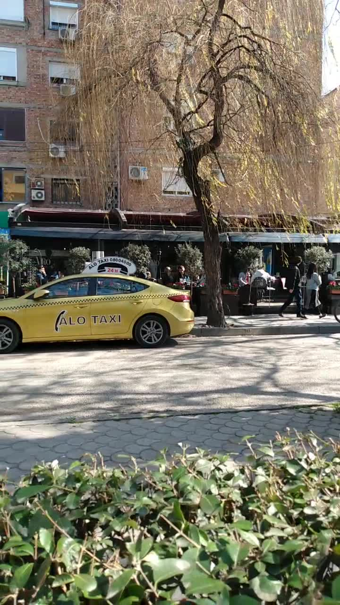
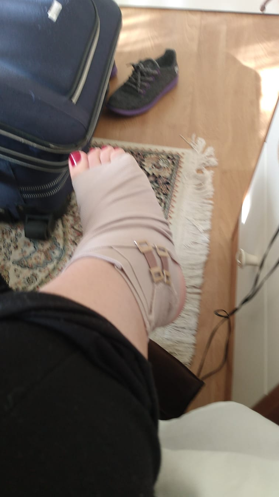
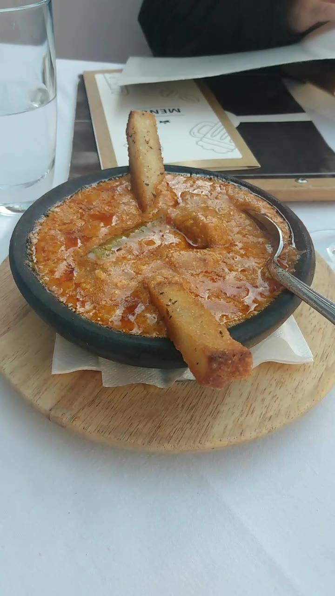
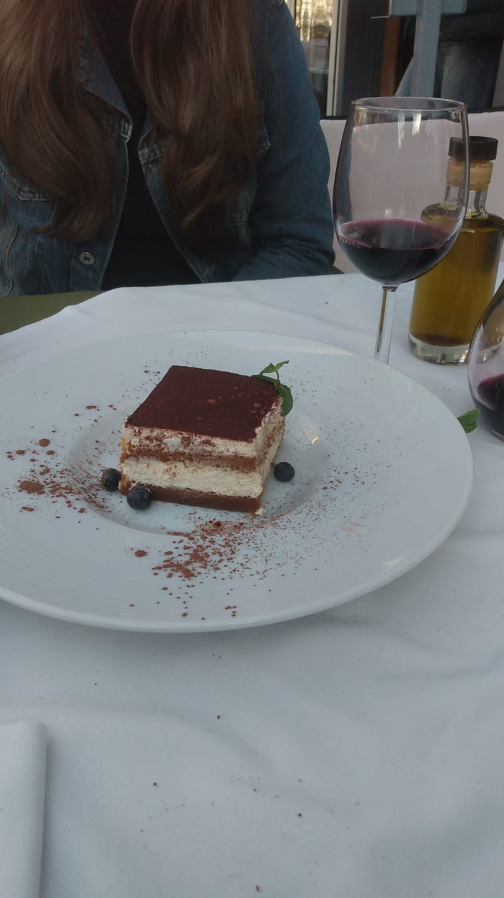

Estamos hospedados em um pequeno hotel no bairro [Bbloku](https://en.wikipedia.org/wiki/Ish-Blloku), um dos bairros mais conhecidos de Tirana.

Antigamente, este bairro era proibido para entrada do público geral; apenas membros do partido comunista podiam frequentá-lo. Atualmente, é uma área cheia de bares, cafés, lounges e, claro, albaneses.

## Primeiras impressões

Logo de cara fomos muito marcados pela receptividade dos albaneses. O taxista que nos trouxe até o hotel fez questão de passar por todas as rádios e nos mostrar todos os estilos de música albanesa 😂 (por sinal a influência árabe ficou bastante evidente para a gente nesse ponto).

Outro aspecto que nos surpreendeu é que muitos albanases falam italiano. Sim! A Itália tem uma influência muito forte na Albânia: andando pelas ruas do Bbloku, é super comum encontrar lojas, cartazes e anúncios em italiano. Conversando hoje cedo com um albanês (em italiano), ele nos disse que a sua geração cresceu escutando muito italiano: aparentemente a TV albanesa transmite muito conteúdo direto da Itália.

*Comunque, grazie Italia!* Porque entender a [língua albanesa](https://pt.wikipedia.org/wiki/L%C3%ADngua_albanesa) ia ser complicado...

Tirana, apesar de visivelmente mais pobre do que os mais "badalados" destinos europeus, em muitos sentidos tem cara de uma típica cidade europeia: ruas estreitas, construções bastante antigas, transito um tanto quanto caótico e árvores com folhas secas.

*Vista de onde tomamos café da manhã, no Bbloku*

## Tornozelo torcido

Logo pela manhã, uma surpresa desagradável. A Maithe foi atravessar a rua para tirar uma foto, tropeçou no buraco e torceu o tornozelo. Não sabemos ao certo a gravidade da situação - o tornozelo inchou bastante e ela sente bastante dor ao pisar. Por enquanto, apenas muito gelo e faixa. Esperamos que com o passar dos dias melhore... ou então vão ter posts sobre hospitais na Albânia 🤷‍♂️

*Tornozelo torcido da Maithe*

## Tiramisu

Hoje almoçamos em um restaurante maravilhoso aqui do bairro que a dona do hotel nos indicou. Os destaques vão para um prato típico aqui da Albânia chamado Fergesë (uma espécie de carne ao molho de tomate com queijo Feta e polenta frita) e, claro, o Tiramisu que pedimos de sobremesa.

*Ferghese - prato típico da Albânia*

*Tiramisu para fechar o almoço*

Amanhã vamos para [Saranda](https://en.wikipedia.org/wiki/Sarand%C3%AB) - uma linda cidade de praia no sul da país. Assim que sobrar um tempinho atualizaremos o blog por aqui. 

*Ciao!*
