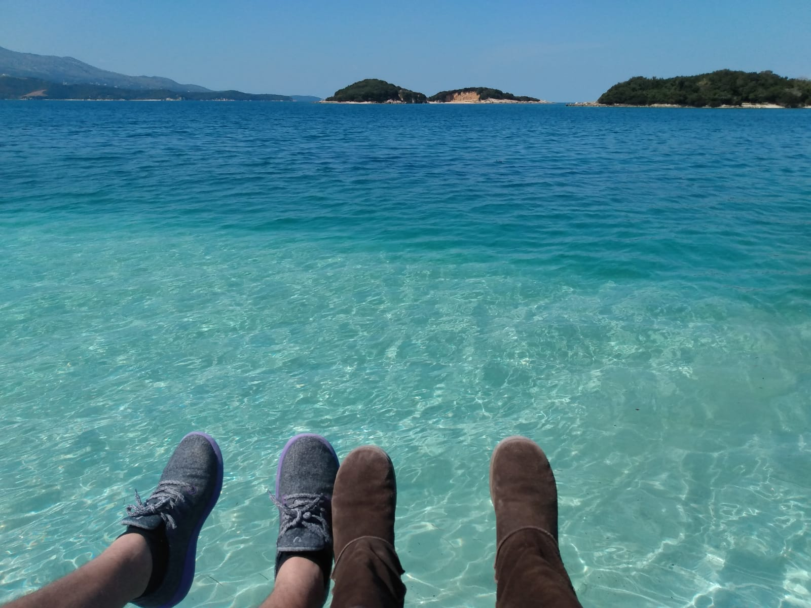
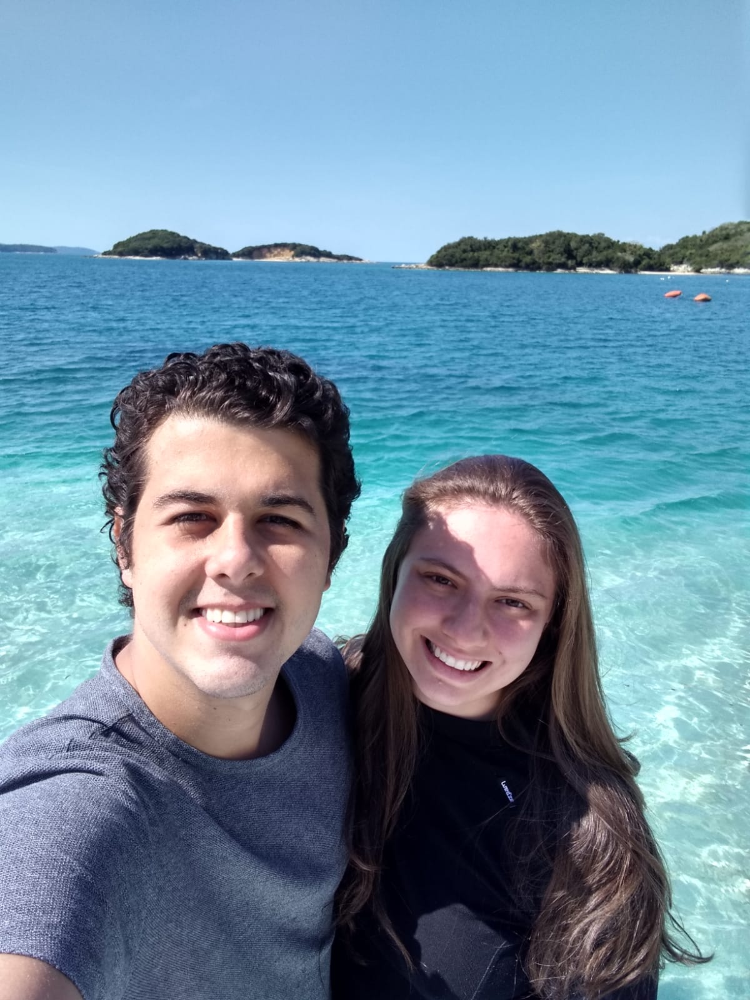
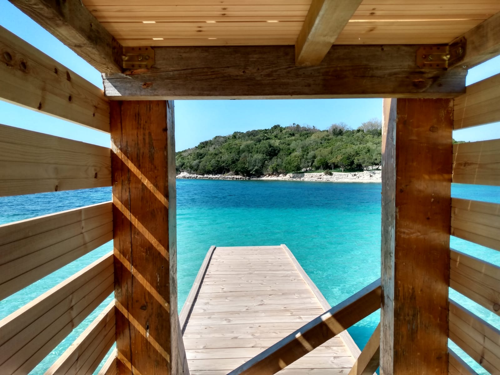
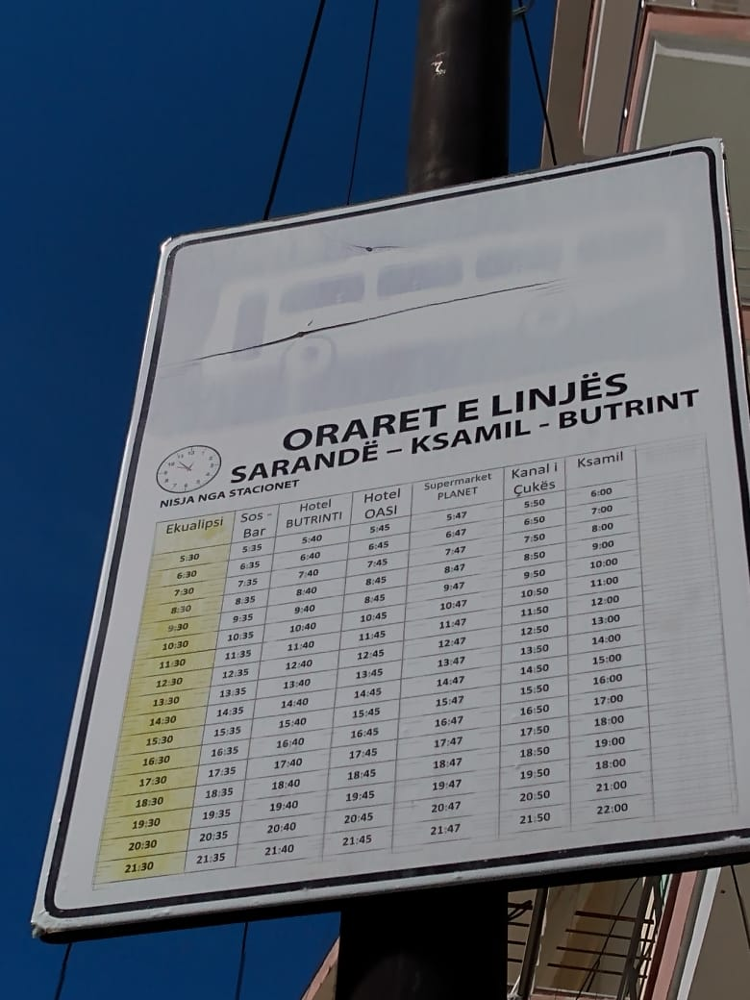
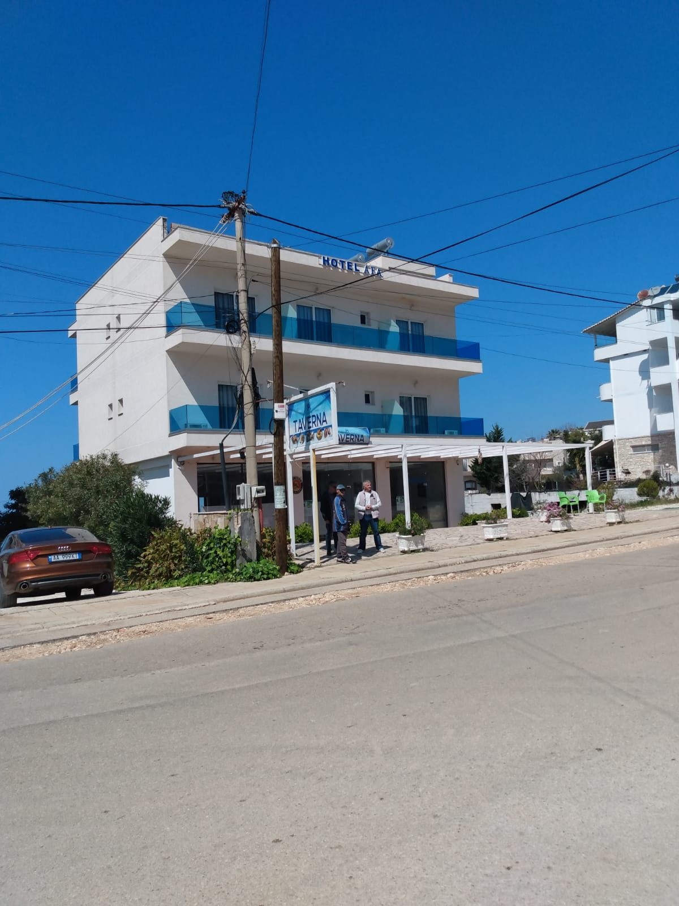

## Chegou a hora da queridinha da Albânia!

Nesse final de semana fomos conhecer Ksamil, uma região muito visitada da Riviera Albanesa e um verdadeiro paraíso.

A gente chama de inexplorado porque não vemos tantas propagandas desse lugar quanto vemos dos badalados destinos europeus, e consequentemente as pessoas visitam menos, mas acreditem: **vale tão a pena quanto**.

## O paraíso tem nome!

E é de tirar o fôlego a beleza desse lugar! Toda costa de Ksamil é exuberante, aquela vista que nao dá pra explicar em palavras... A gente escreve, descreve, mostra fotos, mas nada é suficiente para ilustrar 100% a verdadeira pintura que é esse cantinho do mundo.

*Praia de Bora-Bora*

*Olhem a cor desse mar* 😱

*Brega sem ser romântico* 😂

*Ou romântico sem ser brega?* 🥰 

*O que falar desse lugar que mal conheço e já considero pakas?*

## Como chegar?

Existe um ônibus munincipal que faz o trajeto Saranda <> Ksamil todos os dias, a cada 1 hora. O trajeto todo leva em torno de 30 minutos e custa 100 Lek por pessoa (o equivalente a 80 centavos de Euro, na cotação de hoje).

*Horários do ônibus que leva de Saranda a Ksamil*

Na chegada a Ksamil, **cuidado para não perder o ponto de descida**: não existe nenhuma sinalização e se não fosse a moça que estava do nosso lado para nos avisar teríamos perdido o ponto. 🤣

*Chegando em Ksamil, desça em frente ao Hotel AFA*

## Vale a pena ir fora de temporada?

Com certeza!

Na primavera as temperaturas chegam a 20°C e dá para curtir a praia tranquilamente. Ainda que não se compare com o calor do verão, pelo menos tem o lado bom de poder curtir as praias em um ambiente mais deserto e silencioso.

Só não vai fazer que nem o Lucas e tentar entrar no mar de cueca e sem roupa de troca 🤣🤣👇👇

`video: https://www.youtube.com/watch?v=E7fZLqLv8t0`

## Bate-volta de Saranda

Ksamil fica tão perto que dá para fazer um bate-volta e ainda pegar o pôr do sol em Saranda!

E por falar em pôr do sol, encerramos este post com a nossa (tentativa de) *time-lapse* que registramos mais cedo aqui em Saranda e com a única certeza de que temos: **o sol se põe no horizonte e amanhã é um novo dia**.

Até a próxima 😊

`video: https://www.youtube.com/watch?v=fSOJvfEUY-o`
