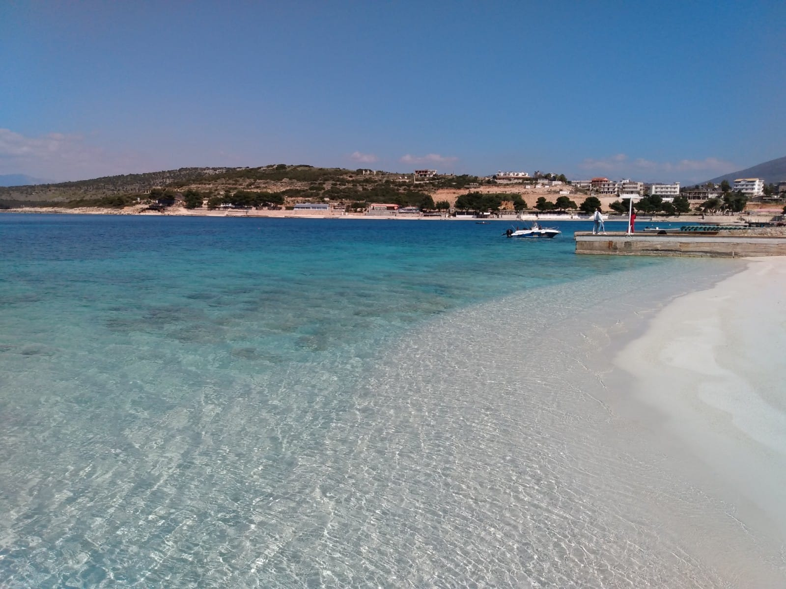
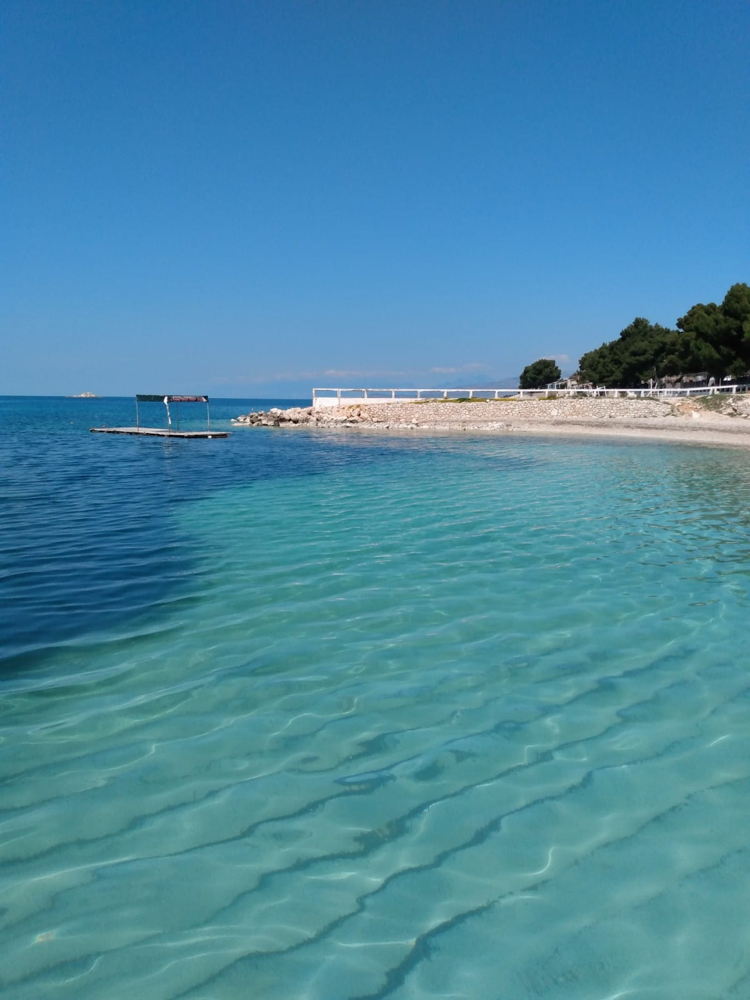

## Chegou a hora da queridinha da Albânia! 

Nesse final de semana fomos conhecer Ksamil, uma região muito visitada da Riviera Albanesa e um verdadeiro paraíso. 

A gente chama de inexplorado por quê não vemos muitas propagandas desse lugar quanto vemos dos típicos destinos na Europa, e consequentemente as pessoas visitam menos, mas acreditem: vale tão a pena quanto.

## O paraíso tem nome!

É de tirar o fôlego a beleza desse lugar! Toda costa de Ksamil é exuberante, aquela vista que nao dá pra explicar em palavras... Talvez com fotos dê pra mostrar pra vocês um pouco do que vimos por lá, mas nem elas mostram a verdadeira pintura que é esse cantinho do mundo.

*Praia de Bora-Bora* 

*Olhem a cor desse mar*  😱

Algumas informações para quem planeja conhecer: o próprio ônibus municipal faz esse trajeto de Saranda <-> Ksamil, custa por volta de 1 euro e leva meia hora até o centro. Não tem taxa para entrar nas praias e é tudo bem estruturado para receber turistas no verão.

## Pôr do sol em Saranda

Como bons caçadores do melhor pôr do sol, a gente termina esse post com mais uma pintura da natureza, só que agora no céu! 

Na sexta-feira pegamos o pôr do sol em um lugar estratégico em Saranda, com as pernas penduradas numa mureta e os pés tocando o mar. Fiquem com esse time lapse de encerramento, com a única certeza que temos: o sol se põe no horizonte e amanhã é um novo dia.

Até a próxima 😊
